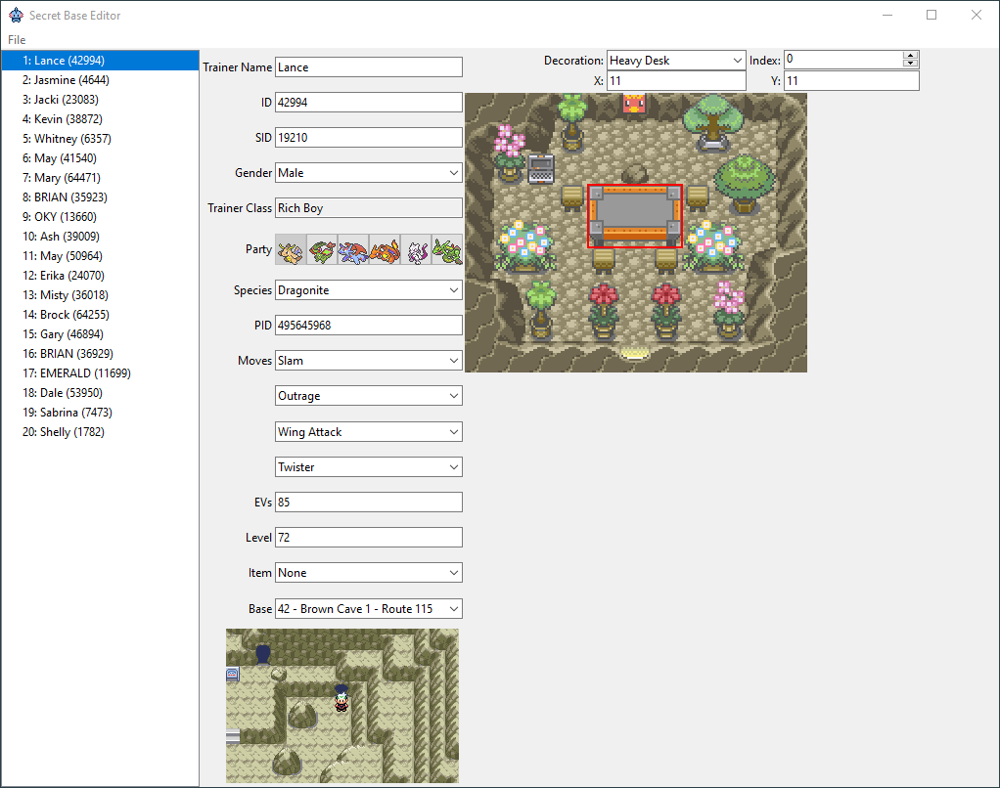

# Secret Base Editor

This is a tool to view, edit, and save Secret Bases in Pokémon Ruby, Sapphire, and Emerald. Requires Python 3.10+.

If [Pillow](https://pypi.org/project/pillow/) is installed, the tool can export images of the Secret Bases.

